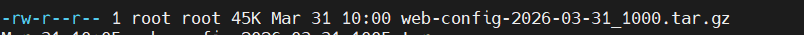

#!/bin/bash

SOURCE_DIR="/etc/nginx" 
BACKUP_DEST="/mnt/raid_data/backups"
DATE=$(date +%Y-%m-%d_%H%M)
FILENAME="web-config-$DATE.tar.gz"
RETENTION_DAYS=7

if [ ! -d "$BACKUP_DEST" ]; then
    mkdir -p "$BACKUP_DEST"
fi

if ! mountpoint -q /mnt/raid_data; then
    echo "Error: RAID arrayy not mounted right. Aborting backup."
    exit 1
fi

echo "creatting backup  of $SOURCE_DIR to $BACKUP_DEST..."

tar -czf "$BACKUP_DEST/$FILENAME" "$SOURCE_DIR"

if [ $? -eq 0 ]; then
    echo "Backup created well: $FILENAME"
    # Log to system logs for 'grep' verification later
    logger "RAID_BACKUP_SUCCESS: $FILENAME"
else
    echo "failed to create backup"
    logger "RAID_BACKUP_FAILURE: Could not create $FILENAME"
    exit 1
fi

# extra credit and stuff
echo "cleaning up  older than $RETENTION_DAYS days..."
find "$BACKUP_DEST" -type f -name "web-config-*" -mtime +$RETENTION_DAYS -exec rm {} \;
echo "finished"

0 2 * * * is the logic
start of hour at 2 am every day of the month every day of the week and every month 

output
Mar 31 00:00:02 server-name root: RAID_BACKUP_SUCCESS: web-config-2026-03-31_0000.tar.g

