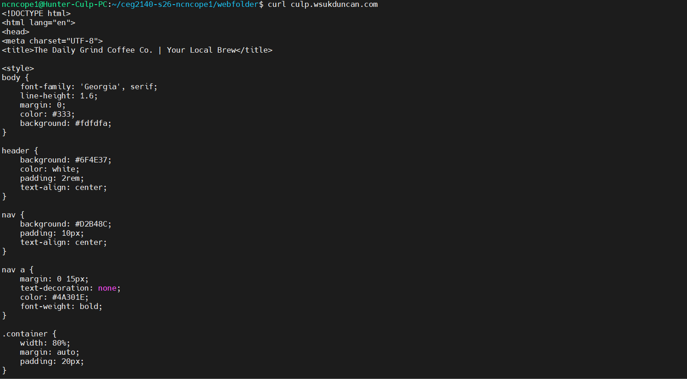
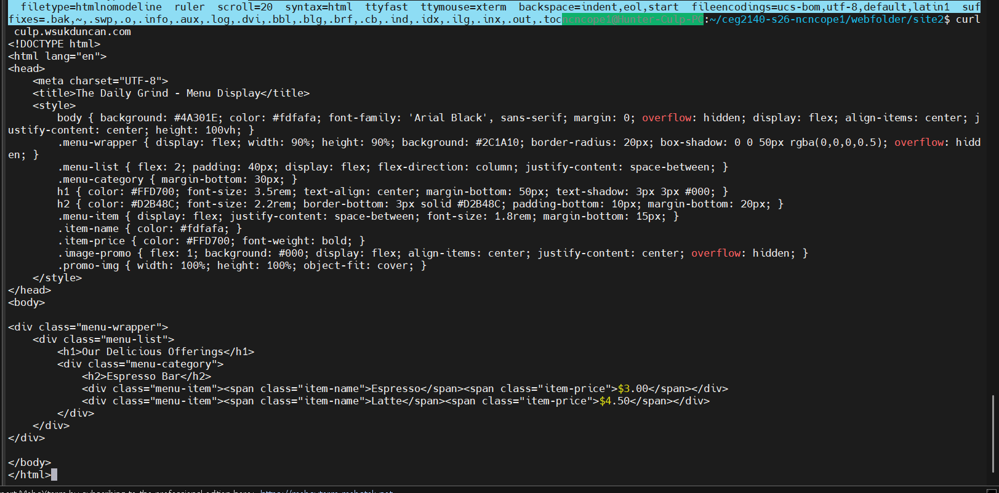

key pieces 

listen 80 will specify the port serrver monitors

server name will be culp.wsuduncan.com

root is the file site

index defines the server file

enable and disable site using nginx

sudo ln -s /etc/nginx/sites-available/mysite /etc/nginx/sites-enabled/
this enables it

sudo rm /etc/nginx/sites-enabled/mysite
this disables it

to restart
sudo nginx -t do this to avoid typos

sudo systemctl restart nginx

culp.wsukduncan.com

coffe-menu.com

two websites names

logs /var/log/nginx/access.log

/var/log/nginx/error.log

(screenshots added later)

ss 1 

 
ss 2 

